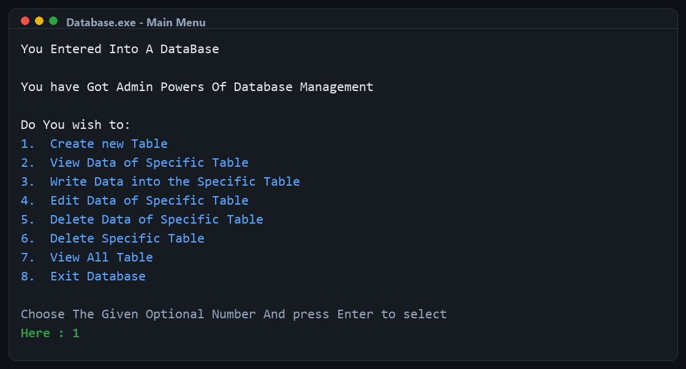
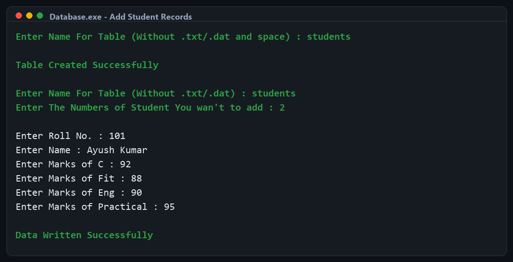
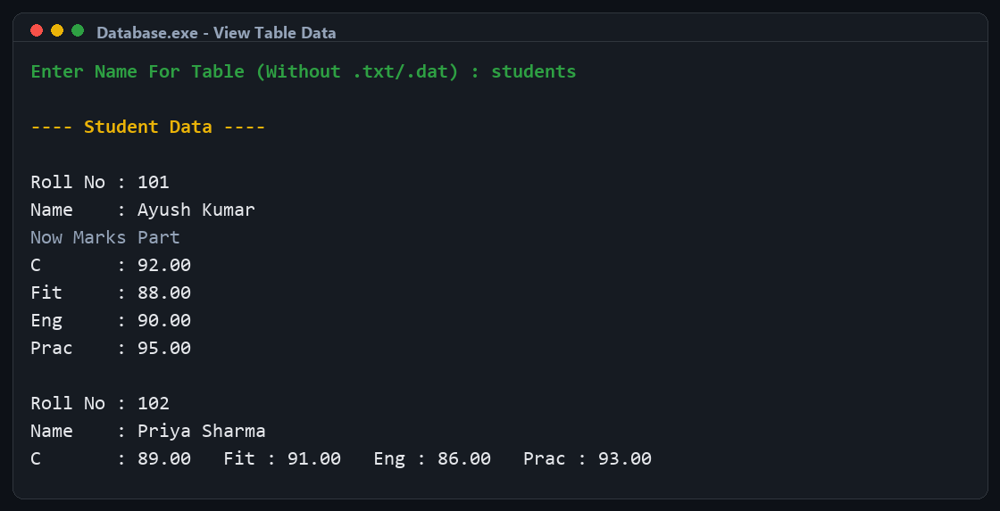

# Student Database Management System

A simple command-line database management program written in C. The application lets an administrator create student data tables, add records, view records, edit student details, delete individual records, delete complete tables, and list all created tables.

The project is built around binary file storage, where each table is saved as a `.dat` file and all table names are tracked in a master registry file named `tables.dat`.

## Screenshots

### Main Menu



### Adding Student Records



### Viewing Table Data



## Features

- Create a new student table
- Add one or more student records to a selected table
- View all records in a selected table
- Edit a student's name or marks by roll number
- Delete a student record by roll number
- Delete an entire table
- View all created tables
- Store table data persistently using binary files

## Data Model

Each student record contains:

| Field | Description |
| --- | --- |
| `Roll_no` | Student roll number |
| `Name` | Student name, up to 19 characters |
| `C` | Marks in C |
| `Fit` | Marks in FIT |
| `Eng` | Marks in English |
| `Prac` | Practical marks |

Internally, records are stored using the `struct DATABASE` structure defined in `Database.c`.

## Project Files

| File | Purpose |
| --- | --- |
| `Database.c` | Main source code for the database management program |
| `Database.exe` | Compiled Windows executable, if already built |
| `tables.dat` | Auto-generated master file that stores created table names |
| `<table-name>.dat` | Auto-generated binary file for each student table |

## Requirements

- Windows, Linux, or macOS terminal
- A C compiler such as GCC, MinGW, or Clang

## Build Instructions

From the project directory, compile the program with:

```bash
gcc Database.c -o Database
```

On Windows, you can also create an `.exe` file:

```bash
gcc Database.c -o Database.exe
```

## Run Instructions

After compiling, run the program from the same folder:

```bash
./Database
```

On Windows PowerShell:

```powershell
.\Database.exe
```

Running the program from the project folder is important because table files are created and read from the current working directory.

## Menu Options

When the program starts, it displays the following admin menu:

| Option | Action |
| --- | --- |
| `1` | Create a new table |
| `2` | View data from a specific table |
| `3` | Write student data into a table |
| `4` | Edit student data by roll number |
| `5` | Delete student data by roll number |
| `6` | Delete a specific table |
| `7` | View all created tables |
| `8` | Exit the database |

## Example Workflow

1. Choose option `1` to create a table.
2. Enter a table name, such as `students`.
3. Choose option `3` to add student records to `students`.
4. Choose option `2` to view the records.
5. Choose option `4` or `5` to update or delete a student by roll number.

The program automatically adds the `.dat` extension to table names, so enter only the base table name when prompted.

## Important Notes

- Table names should not include spaces.
- Student names are limited to 19 characters.
- Data files use binary storage, so `.dat` files should not be edited manually in a text editor.
- The `tables.dat` file is created automatically when tables are added.
- Deleted records are handled by writing remaining records to a temporary file and replacing the original table file.

## Possible Improvements

- Add input validation for marks and roll numbers
- Prevent duplicate table entries in `tables.dat`
- Prevent duplicate student roll numbers inside a table
- Add sorting or searching features
- Export records to a readable text or CSV file
- Improve portability by avoiding platform-specific assumptions

## Author

Created as a C programming project for practicing file handling, structures, dynamic memory allocation, and command-line database operations.
